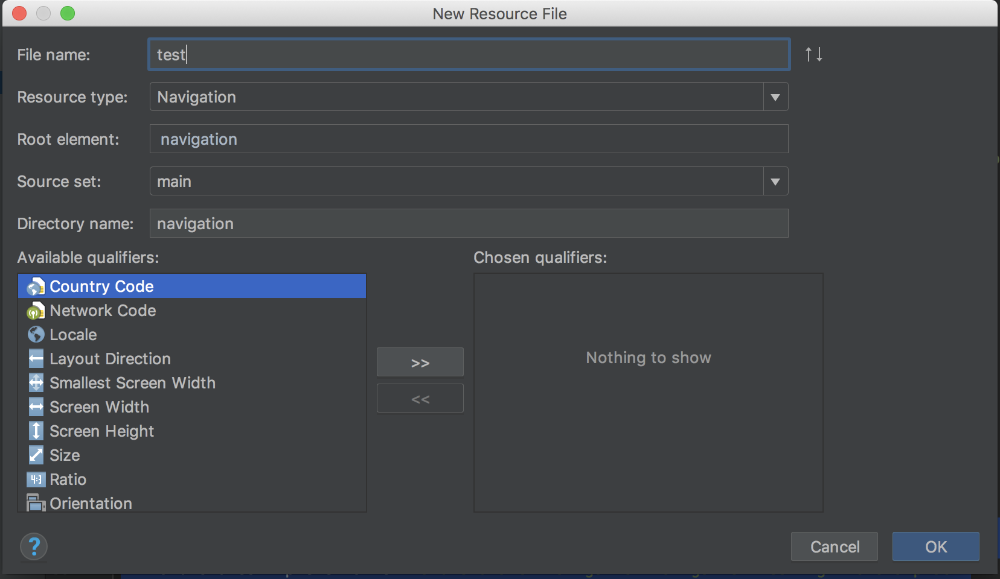
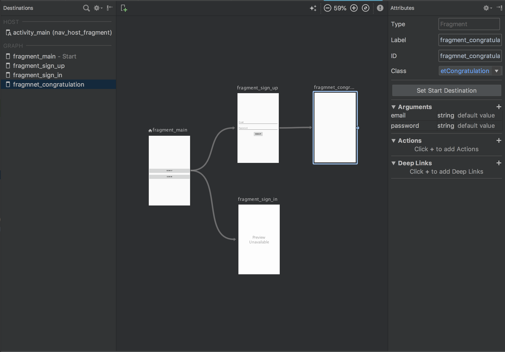
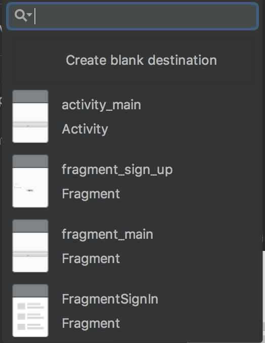
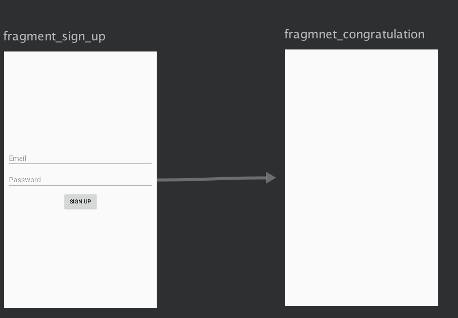
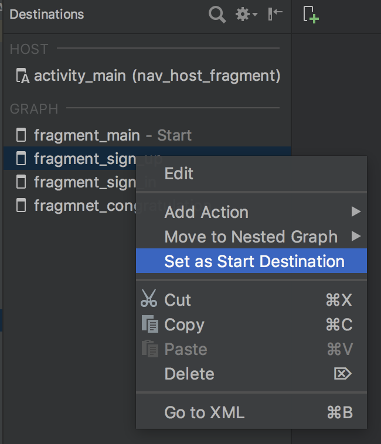
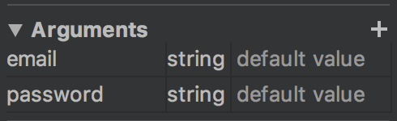
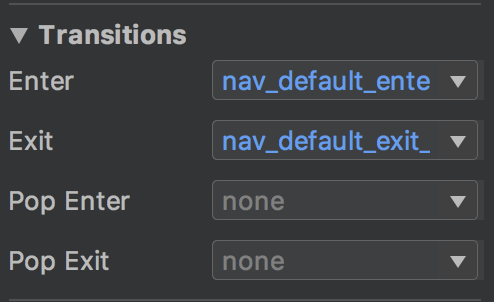

# The Navigation Architecture Component

## Вступление

Построение навигации в android приложении всегда была проблемой многих разработчиков. Сообщество написало много библиотек которые в какой-то мере решали проблемы, но многие ждали решение именно от Google. На Google IO 2018 анонсируют Navigation Architecture Component которое входит в состав Jetpack. На данный момент данная технология находится в разработке, но уже доступна в Android Studio 3.2 Beta.

## Установка и первоначальная настройка проекта

Добавим необходимые зависимости в 'build/gradle'

### Основные библиотеки
~~~ groovy
dependencies {
    implementation "android.arch.navigation:navigation-fragment:1.0.0-alpha05"
    implementation "android.arch.navigation:navigation-ui:1.0.0-alpha05"
    androidTestImplementation "android.arch.navigation:navigation-testing:1.0.0-alpha05"
}
~~~
### Ресурсы
В папке res нужно создать ресурсы для навигации New -> Android resource file
и выбрать Resource type Navigation, укажите имя файла, кликнете OK.

Создается новая директория navigation в которой будет находится ранее созданный файл.

## Обзор начального функционала 

Файл навигационного графа имеет два режима разработки editor и text

### Navigation Editor

Предназначен для разработки навигации при помощи ui без написание кода.

Имеет три столбца

1) Destenition - отображает все экране в графе
2) UI  отображение графа
3) Attrigutes - редактор атрибутов графа

### Text

В этом режиме мы пишем xml код 

~~~ html
<?xml version="1.0" encoding="utf-8"?>
<navigation xmlns:android="http://schemas.android.com/apk/res/android"
    xmlns:app="http://schemas.android.com/apk/res-auto"
    xmlns:tools="http://schemas.android.com/tools"
    android:id="@+id/test"
    app:startDestination="@id/mainActivity">

    <activity
        android:id="@+id/mainActivity"
        android:name="andrey.murzin.navigation.MainActivity"
        android:label="activity_main"
        tools:layout="@layout/activity_main" />
</navigation>
~~~

## Создание графа навигации

Библиотека navigation предназначена для реализации “single activity application” поэтому  activity выступает в роли "хоста" графа. Если в приложении несколько activity то каждая activity будет иметь свой граф.

Перейдем к практики и напишем простой навигационный граф постепенно усложняя его.

### Добавление экранов

1) В редакторе графов кликните New Destination . Откроется диалоговое окно New Destination.
2) Кликните Create blank destination или выберете существующий фрагмент или активность. Откроется диалоговое окно Android Component.
3) Введите имя в поле Fragment Name. 
4) Введите имя в поле Fragment Layout Name. Это имя будет присвоено layout файлу фрагмента.
5) Нажмите Finish. 

### Соединение экранов

Навести на экран от которого нужно совершить переход, на нем появится круги и соединить с экраном на который нужно перейти.

При это в xml файле генерируется action который указывает на следующий fragment

~~~ html
<fragment
        android:id="@+id/fragment_prev"
        android:name="andrey.murzin.navigation.FragmentMain"
        android:label="fragment_main"
        tools:layout="@layout/fragment_main" >

        <action
            android:id="@+id/action_fragment_prev_to_fragment_next"
            app:destination="@id/fragment_next" />
   
</fragment>
~~~

### Обозначить стартовый экран

1) Выбрав стартовый экран 
2) Кликнуть правой кнопкой мыши
3) Выбрать Set as Start Destinition

либо добавить в navigation в параметры app:startDestination свой fragment

~~~ html
<navigation xmlns:android="http://schemas.android.com/apk/res/android"
    xmlns:app="http://schemas.android.com/apk/res-auto"
    xmlns:tools="http://schemas.android.com/tools"
    android:id="@+id/nav_graph"
    app:startDestination="@id/fragment_start"/>
~~~

### Назначить "хост" навигационного графа

Для того чтобы сделать activity хостом нужно:

1) Добавить в layout activity NavHost
2) Сопоставить с графом

~~~ html
<?xml version="1.0" encoding="utf-8"?>
<FrameLayout xmlns:android="http://schemas.android.com/apk/res/android"
    xmlns:app="http://schemas.android.com/apk/res-auto"
    xmlns:tools="http://schemas.android.com/tools"
    android:layout_width="match_parent"
    android:layout_height="match_parent"
    tools:context=".MainActivity">

    <fragment
        android:layout_width="match_parent"
        android:layout_height="match_parent"
        android:id="@+id/nav_host_fragment"
        android:name="androidx.navigation.fragment.NavHostFragment"
        app:navGraph="@navigation/nav_graph"
        app:defaultNavHost="true" />

</FrameLayout>
~~~

app:defaultNavHost="true" - перехват системной кнопки Back.

3) Далее добавить в acitvity следующий код

~~~ Java
 @Override
 public boolean onSupportNavigateUp() {
        return Navigation.findNavController(this, R.id.nav_host_fragment).navigateUp();
    }
~~~

### Привязка переходов к виджетам

Есть два способа сделать это
~~~ Java
view.findViewById(R.id.btn_sign_up)
                .setOnClickListener(Navigation.createNavigateOnClickListener(R.id.fragment_sign_up, null));
                
view.findViewById(R.id.btn_sign_in)
                .setOnClickListener(v->{
                    Navigation.findNavController(v).navigate(R.id.action_fragment_main_to_fragment_sign_up);
                });
~~~

### Передача данных

1) Далее используем Bundle для передачи данных

~~~ Java
 Bundle bundle = new Bundle();
 bundle.putString("email", edEmail.getText().toString());
 bundle.putString("password", edPassword.getText().toString());
 Navigation.findNavController(view).navigate(R.id.fragmnet_congratulation, bundle);
~~~

2) Достаем данные через getArguments();

~~~ Java
getArguments().getString("email", "");
~~~

Способ не отличается от того как мы передавали данные ранее.
Минусы
1) Ключи для передачи данных нужно объявлять как публичные константы
2) Постоянно нужно проверять куда передаешь и какого типа, и где это используется
Плюсы
1) Мало кода
2) Нового ничего учить не надо

### Передача данных safetype

Есть второй способ передавать данные при помощи type-safe. Этот способ более безопастный.

Чтобы передавать данные этим способом нужно настроить проект

1) Добавить плагин

~~~ groovy
apply plugin: 'com.android.application'
apply plugin: 'androidx.navigation.safeargs'
~~~

2) Добавить в build.gradle зависимость

~~~ groovy
dependencies {
        classpath "android.arch.navigation:navigation-safe-args-gradle-plugin:1.0.0-alpha02"
    }
~~~

3) Выбрав экран в navigation editor  добавляем аргументы

В данный момент так сделать не получится потому что type deprecated и проект не собирется, поэтому напишем руками в Text передоваемые аргументы, указывая тип argType, так же можно указать defaultValue.

~~~ html
    <fragment
        android:id="@+id/fragmnet_congratulation"
        android:name="andrey.murzin.navigation.FragmnetCongratulation"
        android:label="fragment_congratulation"
        tools:layout="@layout/fragment_congratulation" >
        <argument
            android:name="email"
            app:argType="string" />
        <argument
            android:name="password"
            app:argType="string" />
    </fragment>
~~~

4) Передача данных
~~~ java
FragmentSignUpDirections.Action_fragment_sign_up_to_fragmnet_congratulation action
                        = FragmentSignUpDirections
                        .action_fragment_sign_up_to_fragmnet_congratulation("email", "password");
Navigation.findNavController(view).navigate(action);
~~~

5) Извлекаем данные

~~~ java
FragmnetCongratulationArgs.fromBundle(getArguments()).getEmail();
~~~

Этот способ мне кажется более правильным и безопасным в использовании
Плюсы
1) В xml графа можно явно посмотреть что передается и куда.
2) Заполняя FragmentDiraction.Action видим данные которые требуются для передачи
3) Извлечение данных через getter зашищает от ошибок
Минусы
1) Нужно писать больше кода

### Анимация перехода между экранами

1) В Navigation Editor выбрать Action который будет осуществлять анимацию перехода
2) В панели Transiction в выподающем меню выбрать анимацию в переходы и выхода

## Итоги

В настоящее время библиотека находится на ранней альфа-версии. Поэтому использывать ее в боевых проектах пока рано, но не смотря на это Navigation Architecture Component очень гибкая, мощная и интуитивно понятная библиотека.
